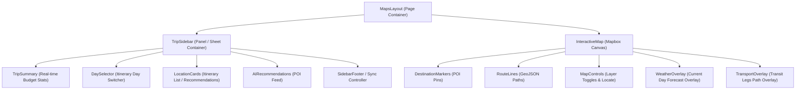

# TripSetGo: Spatial Planning Workspace Architecture

This document defines the component architecture and layout orchestration for the TripSetGo **Spatial Planning Map Workspace**. It validates the hierarchy, data flows, props, and styling compliance against the approved visual and interaction guidelines.

---

## 1. Split Layout & Responsive Orchestration

### Desktop Grid Strategy
On desktop viewports (minimum width: `1024px`), the workspace utilizes a two-column grid template:
- **Sidebar Panel (Left)**: Fixed width of `380px`. Contains itinerary day tabs, active lists, budget status, and recommendations.
- **Interactive Map Canvas (Right)**: Flexible column occupying remaining space (`1fr`). Handles map layers, coordinates, and route calculations.

### Mobile Sheet & Swipe Strategy
On mobile viewports (width below `1024px`), the layout switches to a stacked vertical viewport structure:
- **Background Layer**: `InteractiveMap` takes absolute full-screen width and height (`h-[100dvh]`).
- **Foreground Overlay**: A gesture-enabled sliding **Bottom Sheet** overlay contains the trip details, active schedule list, and controls. It supports drag handles for two snapping points:
  - **Peek State (Default)**: Bottom sheet is docked showing only the current day's headline, active budget status, and a swipeable activity card carousel.
  - **Expanded State (Full Height)**: Bottom sheet pulls up to occupy 80% height, showing full lists, weather details, and recommended activities.

---

## 2. Component Hierarchy

The architectural hierarchy follows the tree representation below:

---

## 3. Component Specification Sheet

For every component in the hierarchy, the specifications are detailed below:

### 1. MapsLayout
- **Purpose**: Page root container. Controls screen layout templates (desktop split grids vs mobile bottom sheets) and loads active trip data.
- **Props**: None (receives routing parameters via Router).
- **Dependencies**: React Router `useParams`, Redux hooks (`useSelector`, `useDispatch`), `fetchTrip` slice thunk.
- **Reusable**: No.
- **Animation**: Entry fade-in (`fadeIn`, 300ms cubic-bezier(0, 0, 0.2, 1)).
- **Loading state**: Displays a global full-screen shimmer outline layout while the trip payload is fetched.
- **Error state**: Wraps components in a standard `ErrorBoundary` rendering recovery cards on failure.
- **Accessibility**: Labeled with `role="main"` and `aria-label="Trip Spatial Planner Dashboard"`.
- **Responsive behavior**:
  - `min-width: 1024px`: Grid structure (`grid grid-cols-[380px_1fr] h-[calc(100vh-64px)]`).
  - `max-width: 1023px`: Absolute wrapper (`relative w-full h-[100dvh] overflow-hidden`).

### 2. TripSidebar
- **Purpose**: Hosts the workspace controllers, itinerary list, active day switcher, and AI suggestions.
- **Props**:
  - `tripData` (Object)
  - `activeDay` (Number)
  - `onDayChange` (Function)
- **Dependencies**: `TripSummary`, `DaySelector`, `LocationCards`, `AIRecommendations`, `framer-motion`.
- **Reusable**: No.
- **Animation**: Desktop: Left-to-right slide-in (`slideInLeft`). Mobile: Swipe-snapping bottom sheet transitions.
- **Loading state**: Swaps child lists with shimmer widgets during loading states.
- **Error state**: Displays fallback message cards if trip properties are invalid.
- **Accessibility**: Serves as landmark `role="region"` with label "Trip Itinerary and Controls".
- **Responsive behavior**: Desktop: Sticky sidebar with auto scroll. Mobile: Replaced by sliding bottom sheet overlay (`drag="y"`).

### 3. InteractiveMap
- **Purpose**: Creates the Mapbox map target DOM canvas and forwards coordinates to map controls.
- **Props**:
  - `center` (Array of [lng, lat])
  - `zoom` (Number)
- **Dependencies**: `useMapbox` hook, `MapContainer` (reused).
- **Reusable**: Yes (Generic map viewport orchestrator).
- **Animation**: Camera viewport translations (`flyTo`, `easeTo`) with duration limits matching gliding motion values.
- **Loading state**: Shows loading mask overlay until map `load` event finishes.
- **Error state**: Shows WebGL fallback card overlay if browser GL target fails.
- **Accessibility**: Labeled `role="application"` with tag "Spatial Travel Route Map".
- **Responsive behavior**: Desktop: Fills right layout grid area. Mobile: Fills 100% of background height/width.

### 4. DestinationMarkers
- **Purpose**: Overlays markers representing trip stops, hotel, and nearby highlights.
- **Props**:
  - `stops` (Array of stop objects)
  - `selectedStopId` (String)
  - `onStopClick` (Function)
- **Dependencies**: `MapMarker` (reused).
- **Reusable**: Yes.
- **Animation**: CSS-based scale transition (`scale-[1.15]`) on hovered markers.
- **Loading state**: None.
- **Error state**: Filters out stop objects containing invalid coordinate pairs.
- **Accessibility**: Each marker receives `role="button"`, `aria-label="Itinerary stop [number]: [name]"`, and standard `tabindex="0"`.
- **Responsive behavior**: No viewport variations.

### 5. RouteLines
- **Purpose**: Draws sequential route paths connecting itinerary stops on the map canvas.
- **Props**:
  - `coordinates` (Array of [lng, lat] pairs)
  - `color` (String)
- **Dependencies**: `RouteLayer` (reused).
- **Reusable**: Yes.
- **Animation**: Updates coordinate arrays inside Mapbox GeoJSON source using `setData` animation transitions.
- **Loading state**: None.
- **Error state**: Falls back to direct straight-line routing layers if route geometry fails.
- **Accessibility**: Visual layer overlay (no direct screen reader interaction).
- **Responsive behavior**: Viewport padding adjusts during `fitBounds` calculations (larger padding values are applied on desktop viewports to clear the sidebar).

### 6. DaySelector
- **Purpose**: Multi-tab switcher to select the active itinerary day.
- **Props**:
  - `totalDays` (Number)
  - `selectedDay` (Number)
  - `onDaySelect` (Function)
- **Dependencies**: Core tab components.
- **Reusable**: Yes.
- **Animation**: Highlight border slides using `framer-motion` layout animation triggers.
- **Loading state**: Disables clicks during update processes.
- **Error state**: Hides or disables indices exceeding bounds.
- **Accessibility**: Configured with `role="tablist"` with active button marked `aria-selected="true"`.
- **Responsive behavior**: Desktop: Grid button cluster. Mobile: Swipeable horizontal tab bar.

### 7. LocationCards
- **Purpose**: Displays card details (image, category, address, rating) for stops and supports adding or removal actions.
- **Props**:
  - `data` (Object)
  - `order` (Number)
  - `variant` (String: `stop` | `recommendation`)
  - `onAction` (Function)
- **Dependencies**: Button components.
- **Reusable**: Yes.
- **Animation**: Slide fade transitions. Drag layouts for ordering steps.
- **Loading state**: Shimmer templates replace typography nodes.
- **Error state**: Broken images fallback to default vector category placeholders.
- **Accessibility**: Card wrapper is labeled `role="listitem"` and houses explicit labels for action icons (e.g. `aria-label="Add [place] to itinerary"`).
- **Responsive behavior**: Desktop: Fixed card lists. Mobile: Swipeable items with swipe-to-delete behaviors.

### 8. WeatherOverlay
- **Purpose**: Renders the daily forecast summary on the map area.
- **Props**:
  - `location` (String)
  - `date` (String)
- **Dependencies**: Redux forecast hooks.
- **Reusable**: Yes.
- **Animation**: Soft fades.
- **Loading state**: Spinning loader indicators.
- **Error state**: Hides silently.
- **Accessibility**: Screen reader text output wrappers.
- **Responsive behavior**: Desktop: Docked in left sidebar top. Mobile: Absolute badge overlaying map.

### 9. TransportOverlay
- **Purpose**: Visualizes flight or travel segments connecting the origin to the destination.
- **Props**:
  - `transit` (Object)
- **Dependencies**: Route layer assets.
- **Reusable**: Yes.
- **Animation**: Pulsing dashed line animation pathing across map.
- **Loading state**: Shimmer indicators.
- **Error state**: Text shows "Transit routing data unavailable".
- **Accessibility**: Labeled outline readouts.
- **Responsive behavior**: Desktop: Header block. Mobile: Collapsed top sheet status.

### 10. AIRecommendations
- **Purpose**: Feeds personalized nearby activities, dining, and hotel suggestions matching trip filters.
- **Props**:
  - `suggestions` (Array)
  - `onAdd` (Function)
- **Dependencies**: `LocationCards`.
- **Reusable**: Yes.
- **Animation**: List items staggered with standard entries.
- **Loading state**: Shimmer lists.
- **Error state**: Displays standard empty placeholder card.
- **Accessibility**: Logical outline blocks with descriptive headers.
- **Responsive behavior**: Desktop: Vertical tab list under itinerary stops. Mobile: Slide-up selection drawer.

### 11. MapControls
- **Purpose**: Houses map layout triggers (Locate, Zoom buttons, satellites vs dark style layer toggles).
- **Props**:
  - `map` (Object)
  - `selectedStyle` (String)
  - `onStyleChange` (Function)
- **Dependencies**: Standard button layouts.
- **Reusable**: Yes.
- **Animation**: Slide transitions on hover controls.
- **Loading state**: None.
- **Error state**: Hides locate trigger if GPS permission is disabled.
- **Accessibility**: Buttons feature accessible names (`aria-label="Center map to location"`).
- **Responsive behavior**: Desktop: Anchored top-right. Mobile: Placed bottom-left to prevent clashing with bottom sheets.

### 12. TripSummary
- **Purpose**: Sticky indicator showing budget progress (total selections cost vs target budget).
- **Props**:
  - `spend` (Number)
  - `budget` (Number)
- **Dependencies**: `selectLiveBudget` selector.
- **Reusable**: No.
- **Animation**: Numbers count up smoothly.
- **Loading state**: Shimmer indicators.
- **Error state**: Red warning borders show if budget goes over limit.
- **Accessibility**: Section labeled `aria-live="polite"` to read budget updates.
- **Responsive behavior**: Desktop: Sidebar header panel. Mobile: Compact overlay header.

### 13. Footer
- **Purpose**: Controls workspace actions (Save draft, print plan, collaborate status).
- **Props**:
  - `isSyncing` (Boolean)
- **Dependencies**: Socket indicators.
- **Reusable**: Yes.
- **Animation**: Pulses in synchronization states.
- **Loading state**: Disables action indicators.
- **Error state**: Shows red connection status if socket collapses.
- **Accessibility**: Standard layout landmarks.
- **Responsive behavior**: Desktop: Sidebar bottom panel. Mobile: Embedded inside sheet layout.
