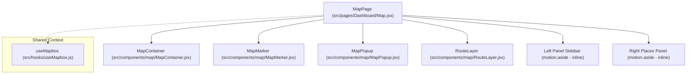
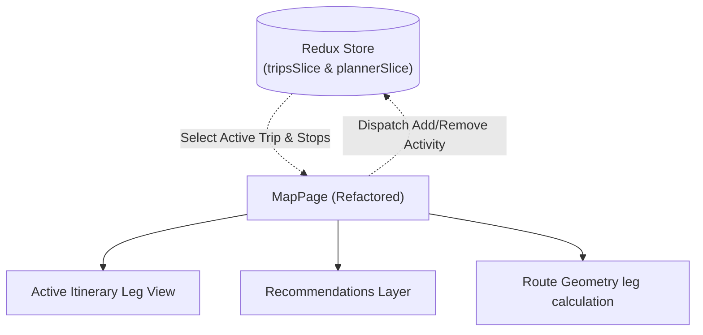

# TripSetGo: Interactive Maps Workspace Implementation Review

This document provides a detailed structural, visual, and architectural analysis of the current Mapbox integration and related pages in **TripSetGo**. It identifies structural deficiencies and gaps compared to the approved design documentation (Aurora Visual Guidelines, Design System, Motion System, UX Flow Book) and outlines recommendations for turning the exploratory map into a fully integrated spatial planning workspace.

---

## 1. Architectural Overview

The current map implementation is designed as an isolated search tool rather than an integrated workspace:
- **State Management**: Fully reliant on React local state (`useState`, `useEffect`, `useRef`). It does not interface with the centralized Redux store or RTK Query endpoints.
- **Data Flow**: Fetches nearby points of interest (hotels, restaurants, attractions) on-demand using local coordinates. These calls bypass RTK Query's caching and lifecycle synchronization.
- **Geocoding**: Translates search queries into coordinates using a localized geocoding endpoint, flying the map camera to the target city.
- **Route Visualization**: Extremely simple. Connects only two arbitrary coordinates (the first fetched hotel and attraction) using a straight-line dashed layer, rather than utilizing actual route path geometry or ordering.

---

## 2. Component Hierarchy

The following diagram illustrates the relationship between the active map pages and supporting visual layers:

---

## 3. Component Classification Matrix

Each component involved in the Maps workspace is classified according to the required action:

| Component | Target File | Classification | Rationale & Gap Analysis |
| :--- | :--- | :--- | :--- |
| **MapPage** | [Map.jsx](file:///e:/Desktop/Web%20Development/Hack18_TripSetGo/frontend/src/pages/Dashboard/Map.jsx) | **REFACTOR** | Currently functions as a standalone place explorer. Must be refactored to read from Redux (`selectCurrentTrip`, `selectSelections`), support day selectors, and handle planner edits. Uses gradient text, violating Aurora constraints. |
| **MapContainer** | [MapContainer.jsx](file:///e:/Desktop/Web%20Development/Hack18_TripSetGo/frontend/src/components/map/MapContainer.jsx) | **KEEP** | Functions correctly as a container. Appropriately isolates the Mapbox target DOM node ref from React's virtual DOM updates. |
| **MapMarker** | [MapMarker.jsx](file:///e:/Desktop/Web%20Development/Hack18_TripSetGo/frontend/src/components/map/MapMarker.jsx) | **EXTEND** | Uses hardcoded hex colors (`#6366f1`, `#10b981`, `#f59e0b`). Must be extended to support Aurora design system variables, marker numbers (e.g. stop order labels), and custom stay indicators. |
| **MapPopup** | [MapPopup.jsx](file:///e:/Desktop/Web%20Development/Hack18_TripSetGo/frontend/src/components/map/MapPopup.jsx) | **MODIFY** | Generates raw HTML strings with inline pixel margins and custom colors. Needs modification to use CSS variables from `index.css` and support planning action buttons (e.g. "Add to Itinerary"). |
| **RouteLayer** | [RouteLayer.jsx](file:///e:/Desktop/Web%20Development/Hack18_TripSetGo/frontend/src/components/map/RouteLayer.jsx) | **EXTEND** | Only draws a straight dotted line between two coordinates. Must be extended to load multi-stop itineraries and support path calculation for driving or walking route shapes. |
| **MapPreview** | [MapPreview.jsx](file:///e:/Desktop/Web%20Development/Hack18_TripSetGo/frontend/src/pages/Dashboard/components/Planner/MapPreview.jsx) | **KEEP** | Serves as a useful preview widget in the Planner Results screen. Correctly maps daily schedules to coordinates. |
| **useMapbox** | [useMapbox.js](file:///e:/Desktop/Web%20Development/Hack18_TripSetGo/frontend/src/hooks/useMapbox.js) | **MODIFY** | Set the default stylesheet parameter to dark mode (`mapbox://styles/mapbox/dark-v11`) to align with the default theme. Needs teardown optimizations. |

---

## 4. Gap Analysis & Compliance Review

### Existing Map Components
- **Implementation**: `MapContainer` handles mount/unmount bindings cleanly. Custom hook `useMapbox` abstracts Mapbox instance references.
- **Compliance Gap**: The default theme in `useMapbox` is set to `streets-v12` (light colors), which conflicts with the default dark background requirements. Popups use hardcoded dimensions instead of fitting container panels.

### Existing Marker Components
- **Implementation**: Markers are generated dynamically using `document.createElement('div')` and added to the map using `mapboxgl.Marker`.
- **Compliance Gap**: The markers use fixed inline values. They do not adapt to user styles, lack support for sequence indexing, and present no visual indicators for loaded itinerary items versus recommendation markers.

### Existing Sidebar & Panels
- **Implementation**: A left sidebar holds controls (radius inputs, layer selections), and a right panel lists details in a custom-scrolling layout.
- **Compliance Gap**: The sidebars occupy fixed widths (`224px` and `340px`) that compress the map display area. The design does not feature a collapsibility toggle for wider viewing space.

### Existing Trip Synchronization (Critical Defect)
- **Implementation**: Fully isolated from active trips.
- **Compliance Gap**: It does not synchronize with current planner states. When a user creates or views a trip, this map has no mechanism to display it, select the itinerary days, or add nearby recommendations directly to the itinerary stages.

### Loading & Empty States
- **Implementation**: A small spinner displays beside the radius, and fallback messages show when lists are empty.
- **Compliance Gap**: Lacks progressive skeleton components in list views. It does not display a loading indicator for geocoding queries, leaving the interface unresponsive during API requests.

### Error Handling
- **Implementation**: Covers general Mapbox GL loading failures with a glassmorphic overlay. Captures API failure states to prevent page crashes.
- **Compliance Gap**: Inline errors print directly below the controllers in small, low-contrast orange tags. These lack the clean design of the standard Aurora error card components.

### Motion & Transitions
- **Implementation**: Uses Framer Motion for slide-ins and Mapbox camera methods (`flyTo`, `easeTo`) for pans.
- **Compliance Gap**: The marker hover scale is applied directly to style objects (`scale(1.2)`), which can cause visual jitter. Transitions must be moved to CSS transitions using `--transition-fast` tokens.

### Accessibility (A11y)
- **Implementation**: Standard focus ring configuration.
- **Compliance Gap**: Markers generated in the DOM are standard `div` elements lacking `role="button"`, `aria-label`, or keyboard tab-index tags. They are entirely invisible to assistive technologies.

### Responsive Design
- **Implementation**: Layout structures use flexbox columns.
- **Compliance Gap**: Fixed panel widths compress the map wrapper on tablets and small screens. It lacks mobile drawers, gesture support, or collapse states, rendering the map page unusable on mobile viewports.

---

## 5. Architectural Recommendations

To transition this view into TripSetGo's **spatial planning workspace**, the following updates are planned:

1. **Redux Synchronization**: Connect the page to Redux store values:
   - Extract the active plan with `selectPlan` and selections with `selectSelections`.
   - Update itinerary structures to link directly to Mapbox layers.
2. **Itinerary Navigation**: Add a day selector (e.g. Day 1, Day 2, Day 3) to filter and center coordinates for the selected day's activities.
3. **Planning Tools**: Add "Add to Trip" buttons in search result lists and map popup windows. Trigger `toggleActivity` actions when clicked to synchronize changes back to the planner state.
